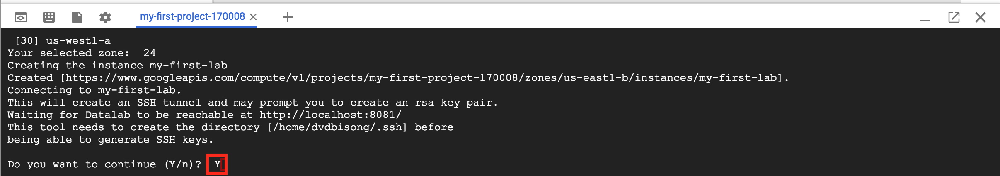

In a previous post titled <a href="/machine-learning-cloud-notes-layman/" target="_blank" rel="noopener">Machine Learning on the cloud</a>, we examined in plain language what is machine learning, what is the cloud, and the merits of leveraging cloud resources for machine learning practice.

In this post, we introduce the Google Cloud Platform as a simple, yet powerful, and cost effective cloud option for performing machine learning. Whats more, we provide a simple walkthrough on how to set up the environment for machine learning model development on GCP.

### Why GCP?

One of the big competitors in the cloud computing space is Google, with their cloud resource offering termed as &#8220;Google Cloud Platform&#8221; popularly referred to as GCP for short.

Google is also one of the top technology leaders in the internet space with a range of top web products such as Gmail, Youtube, Google Hangouts, Google Maps, and Google+, to mention just a few. The aforementioned products generate, store and process tons of Terabytes of data each day from internet users around the world.

To deal with this significant data, Google over the years have invested heavily in processing and storage research and infrastructure. Google as of today boasts some of the most impressive data center design and technology in the world to support their computational demands and computing services.

Google Cloud Platform makes available to the public lighting fast computational speed (it is getting faster!) and high-tech storage capabilities with extremely low latency (meaning minimal delays in data transfer) and high throughput (can be naively described as the time taken to complete a job). Made possible by state of the art networking technology/ infrastructure.

Why this is simply amazing is that the storage and processing platform on which are built products like Gmail, Google Docs and the like, are now accessible to and available for everyone to utilize.

Giving the public access to powerful, highly-distributed computational power has ushered in a new wave of &#8220;real-time intelligence&#8221; to software products. Moreover, this has pushed the boundaries and can yet extend the frontiers of machine learning research.

As we see later in this post, utilizing GCP for machine learning practice is extremely easy, and gets the reader one step closer to using bleeding-edge machine learning technology in the cloud in no time.

### Storage & Processing: The Core of Intelligence

The end-goal of artificial intelligence, of which machine learning is a subset is to build machines that think like humans, and reason, as well as machines that act like people and act rationally. To achieve this feat, figuring how to store information received from the environment, as well as how to process that information to uncover new levels of intelligence is critical. Hence, we see that the two immovable pillars of artificial intelligence are storage and processing, with networking coming in-between to facilitate data flow.

<a href='https://twitter.com/intent/tweet?url=https://ekababisong.org/google-cloud-platform-machine-learning-practice/&#038;text=the%20two%20immovable%20pillars%20of%20artificial%20intelligence%20are%20storage%20and%20processing&#038;related' target='_blank'>the two immovable pillars of artificial intelligence are storage and processing </a><a href='https://twitter.com/intent/tweet?url=https://ekababisong.org/google-cloud-platform-machine-learning-practice/&#038;text=the%20two%20immovable%20pillars%20of%20artificial%20intelligence%20are%20storage%20and%20processing&#038;related' target='_blank' class='bctt-ctt-btn'>Click To Tweet</a>

### An Inspiration from Natural Intelligence

As with the artificial so is it with the natural. Human intelligence is likewise precipitated on our uncanny ability to store and process information at incomprehensible speeds (think networking!) zillions of times faster than the speed of light. I call it the &#8220;speed of thought.&#8221;

Let&#8217;s now touch briefly on the key components of GCP storage and processing capabilities for machine learning practice.

### Storage: Google Cloud Storage

Google Cloud Storage (GCS) on GCP is the stage for storing virtually any data, from flat files, video, audio, you name it!

Google cloud storage is immeasurably scalable, that is to say, the storage space grows as storage needs increases. There is virtually no limit to the volume of data stored. Data stored on Google cloud storage is available anytime, and from any location around the world. Whats more, this massive storage power comes at an almost negligible cost, taking into consideration the size and economic value of the stored data. Moreover, acknowledging the accessibility, security, and consistency provided by cloud storage, the cost seems like nothing.

### Processing: Google Compute Engine

Google compute engine via GCP makes available to users virtual machines that are physically running on Google&#8217;s data centers around the world. Likewise, with cloud storage, the virtual machine scales (i.e. grows) as your processing needs increases.

From a previous post on <a href="/machine-learning-cloud-notes-layman/" target="_blank" rel="noopener">Machine Learning on the Cloud</a>, we see that the real gains of leveraging cloud compute resources are when we use all the computational resource as is needed to solve a particular task and relinquish these resources after processing.

### Playground: Google Datalab

Google data lab on GCP is where machine learning model design and development takes place. This platform is where we run our packages for data cleaning, data exploration, data inference and data preparation for machine learning, and see the results instantly in an interactive manner. It is here that the iterative process of machine learning model development takes place.

Datalab runs on a Google compute engine instance and provides access to data stored on Google cloud storage.

### Setting Up Datalab for Machine Learning: A step-by-step walkthrough

**Step 1:** Create a free account on GCP with a $300 starting credit
  
1). Go to <a href="https://cloud.google.com/" target="_blank" rel="noopener">Google Cloud Platform</a>
  
2). Create a free account &#8211; A credit card is needed to open this free account, although Google does not issue any billing without consent.

Google Cloud Platform - Homepage.

**Step 2:** Create a project
  
A project on GCP is like a container of some sort, which houses all GCP resources used.

GCP Project Dashboard

**Step 3:** Upload data to Google Cloud Platform
  
1). Go to **Storage** from the project dashboard

Google Cloud Storage

2). Create a bucket on Google cloud storage to store data

Create bucket

&#8211; Choose a unique bucket name and click `create`

Cloud storage bucket

3). Click `Upload files` to upload data set to GCS. If data is in a folder, use `Upload folder`

Upload files to GCS

**Step 4:** Launch a Datalab interactive environment running on Google compute instance

1). Click on the icon circled in red below to activate Google cloud shell.

Activate cloud shell

2). From cloud shell, run the command:
  
`datalab create my-first-lab`

Start datalab

3). From the list of zones, select a geographically close zone. Here, we use `[24] us-east1-b`

Select zones

4). When prompted to continue, Press `Y` and then press `Enter`

Press [Y] to continue

5). When asked for a passphrase, simply skip for now by pressing `Enter`. When asked again, press `Enter` once more.

passphrase

6). After the connection to data lab is established, click on  `web preview` and select `Port 8081` to start using data lab

Web preview

Start datalab

7). The data lab interface opens up in a new tab as shown below

Datalab interface

8). Click on `notebook` in the top left corner to start a data lab notebook.
  
9). **Congratulations!** We are now ready for Machine Learning practice using Datalab on Google Cloud Platform.

New datalab notebook

