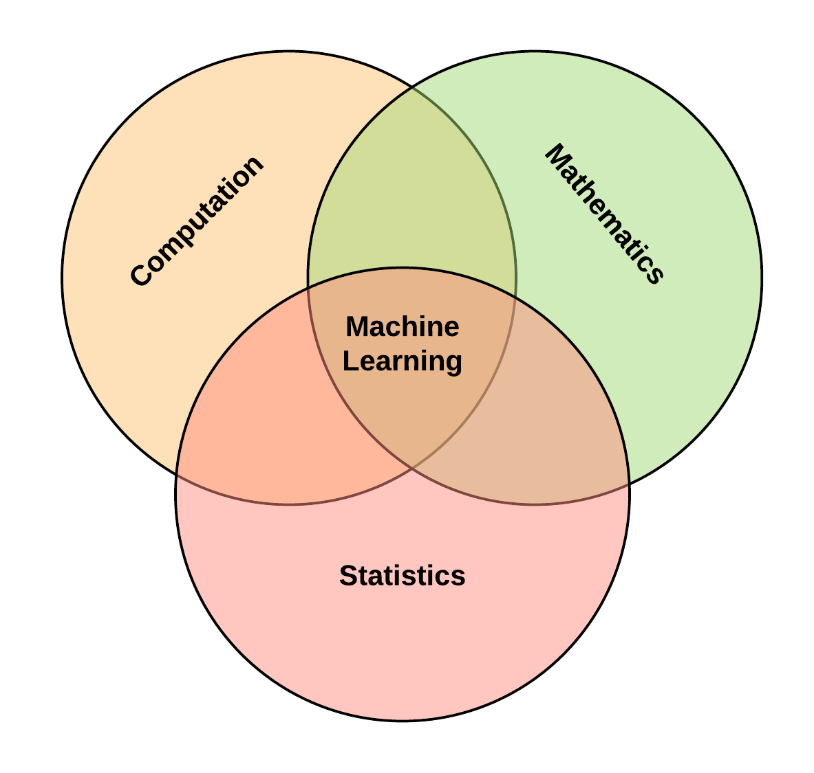

Machine learning is a technology that has grown to prominence over the past ten years (as at this time of writing) and is fast paving the way for the &#8220;Age of Automation&#8221;.

This post provides a holistic view of the vital constituents that characterizes machine learning. At the end of this piece, the reader can be able to grasp the major landmarks and foundation stones of the field. Also, this overview provides a structured framework to wade deeper into murkier waters without getting overly overwhelmed.

### What is Machine Learning?

Machine learning is a set of computational tools and mathematical techniques for predicting the future state or classifying the outcomes of a particular variable (or unit of measurement) based on its interactions with other variables in a data set.

For example, in medicine, if we want to know if a patient has diabetes, we take into consideration features such as the age, weight, blood pressure, geographical and environmental factors of the patient to develop a predictive model for diagnosis. Likewise, in the case of classification, we use the aforementioned features to ascertain if the patient has a type-1 or type-2 diabetes.

In a nutshell, machine learning primarily deals with prediction and classification.

<a href='https://twitter.com/intent/tweet?url=https://ekababisong.org/understanding-machine-learning-executive-overview/&#038;text=machine%20learning%20primarily%20deals%20with%20prediction%20and%20classification.&#038;related' target='_blank'>machine learning primarily deals with prediction and classification. </a><a href='https://twitter.com/intent/tweet?url=https://ekababisong.org/understanding-machine-learning-executive-overview/&#038;text=machine%20learning%20primarily%20deals%20with%20prediction%20and%20classification.&#038;related' target='_blank' class='bctt-ctt-btn'>Click To Tweet</a> 

### What is Learning?

> How do we know when learning has occurred?

Let&#8217;s use a scenario that can perhaps afford us better insights into appraising this question.

A teacher takes a physics class for three months. At the end of the lecture sessions, a test is administered to the student to ascertain if learning has occurred (i.e. to prove if the student has learned anything).

At this point, let us consider two different subplots:
1. The teacher tests the student with an exact word for word replica of questions that earlier served as examples while teaching.
2. The teacher evaluates the student with an entirely different problem set, based on the principles taught in class.

In which of the subplots can the teacher be confident that learning has occurred?

### Norms of Learning
1. Memorization: In the first subplot, it is erroneous for the teacher to form a basis for learning because the student has seen and memorized the examples. Memorization is the act of mastering and storing a pattern for future recollection. Therefore it is inaccurate to use training samples to carry out learning evaluation.

2. Generalization: In the second sub-scenario, the teacher can be confident that the assessment acts as a conclusive test to ascertain if the student has learned anything over the course of the lectures. The ability for the student to extrapolate using the principles taught in class to solve new examples is known as Generalization. Hence, we can conclude that learning is the ability to generalize to new cases.

<a href='https://twitter.com/intent/tweet?url=https://ekababisong.org/understanding-machine-learning-executive-overview/&#038;text=learning%20is%20the%20ability%20to%20generalize%20to%20new%20cases.&#038;related' target='_blank'>learning is the ability to generalize to new cases. </a><a href='https://twitter.com/intent/tweet?url=https://ekababisong.org/understanding-machine-learning-executive-overview/&#038;text=learning%20is%20the%20ability%20to%20generalize%20to%20new%20cases.&#038;related' target='_blank' class='bctt-ctt-btn'>Click To Tweet</a> 

### Core Components of Machine Learning

The three distinct blocks that characterize machine learning are:
1. Supervised learning 
2. Unsupervised learning 
3. Reinforcement learning

Let&#8217;s look briefly into each block.

1. Supervised learning: The idea of supervised learning is to teach the computer using labeled data. The computer learns from data, the patterns that correspond to the desired output. In the diabetes case, we build a predictive model by providing the computer with a dataset of people who have diabetes and those who do not. After learning, the machine is provided with out-of-sample examples to evaluate how well it has learned.

2. Unsupervised learning: In the case of unsupervised learning, there is no such guidance with labeled examples, rather the computer attempts to determine the unknown structure of the data by grouping similar samples of a particular feature.

3. Reinforcement learning: The concept of reward and penalty is central to reinforcement learning. Here the learner interacts with a non-stationary environment, in other words, the computer interacts with an environment that is changing. The machine is rewarded when the response from the environment is favorable and penalized when the response is unfavorable. The value function of the learning task determines the decision on what makes an action favorable or unfavorable. In simpler terms, the goal of the learning problem defines what constitutes the desired action.

### Foundations of ML
The foundational disciplines that contribute to the field of machine learning are:
* Statistics,
* Mathematics, and
* Computation

This diagram below visually describes the interaction between these fields.

Foundations of ML

Other notable mentions are: 
* Biology, &
* Psychology, in particular, mathematical psychology

However, except one is involved in machine learning research, there is no need for an in-depth understanding of these foundational topics to start using machine learning. As we see shortly, software packages make it possible to use machine learning algorithms on the go in business use-cases, as long as the appropriate data is available.

### Machine learning algorithms

Three broad groups of machine learning algorithms are:
1. Linear methods (parametric methods)
2. Non-linear methods (non-parametric methods)
3. Ensemble methods

**Note:** Some algorithms can turn up in multiple groups.

1. Linear methods assume that the underlying structure of the data is linear, put in another form, that there exists a linear interaction between the features of the dataset. Examples of linear algorithms are:
* Linear regression,
* Logistic regression,
* Support vector machines

2. Non-Linear methods do not assume the structural form of the dataset. It uses the examples to learn the internal representation of the data. Examples of non-linear algorithms are:
* K-Nearest Neighbors,
* Classification & regression trees,
* Support vector machines,
* Neural networks

3. Ensemble methods combine the output of multiple algorithms to build a better model estimator, that is, it combines algorithms to create a model that generalizes better to unseen examples. Two major classes of ensemble methods are:
* Boosting, and
* Bagging

### Machine Learning Packages

Machine learning has made a significant transition from the mathematical domain to the software engineering arena over the past ten years. An evidence of this shift is the number of machine learning packages now available as reusable software components for easy implementation in projects. Packages hide the underlying gory mathematical details from the user.

Popular machine learning packages are:
  
* [sickit-learn](http://scikit-learn.org/stable/) (Python programming language)
* [caret](http://topepo.github.io/caret/index.html) (R programming language)
* [Weka](http://www.cs.waikato.ac.nz/ml/weka/) (Java programming language)
* [dlib](http://dlib.net) (C++ programming language)

The entirety of machine learning builds on the key points discussed in this post. Hopefully, this demystifies the field well enough to engage in discussions on machine learning and extension artificial intelligence.

Thank you for reading!