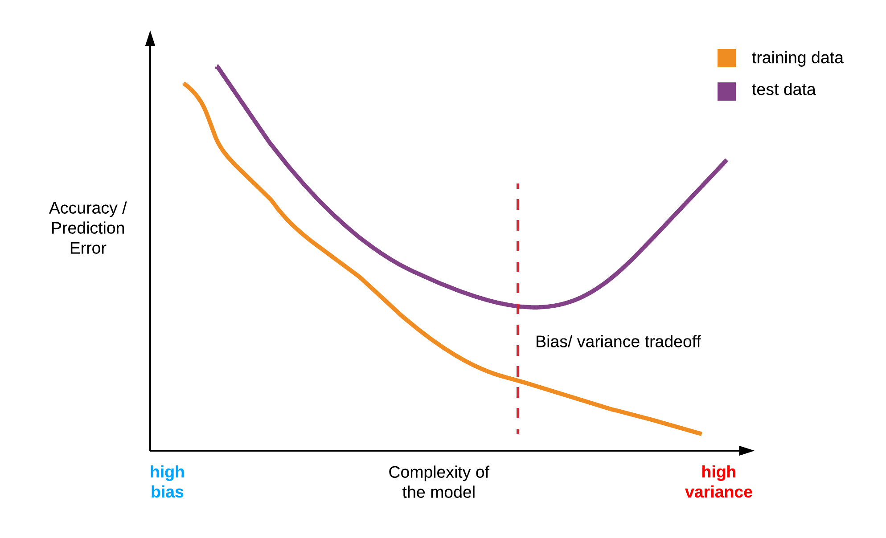

This post gives a systematic overview of the vital points to consider when building supervised learning models. We address in Q&A style some of the key decisions/issues to go over when building a machine learning/ deep learning model. <!--more--> Whether you are an executive or a machine learning engineer, you can use this article to help start comfortable conversations with each other to facilitate stronger communication about machine learning.

The field of machine learning is rapidly evolving, and they are so many materials out there that sometimes it can be overwhelming and confusing. At other times, a plethora of resources can result in what is known as &#8220;the resource curse,&#8221; that is when you have so much but are benefitting so little. In situations like this, there is a need for guidance, for someone to hold the hand and lead by putting the pieces together and interpreting the entire landscape so that it is evident how all the pieces fit together.

This post provides a high-level rundown of some of the vital recipes to follow when building a machine learning model. Aspiring machine learning practitioners express some of their challenges in questions like &#8220;how do I begin building machine learning models?&#8221;, &#8220;what are the key points to consider when working with machine learning?&#8221; This article addresses these issues and also helps non-specialists in leadership roles understand how machine learning engineers approach these questions.

### Where can we find sample data sets

The first step to doing machine learning is to have data. As shown in a previous write-up on machine learning, there is no learning without data.

Thankfully, there are a ton of resources on the internet where we can easily access free and open datasets to use for machine learning practice. A few notable portals are:
* <a href="http://archive.ics.uci.edu/ml/index.php" target="_blank" rel="noopener">UCI Machine Learning repository</a>
* <a href="http://www.kdnuggets.com/datasets/index.html" target="_blank" rel="noopener">KDNuggets</a>
* <a href="https://www.kaggle.com/datasets" target="_blank" rel="noopener">Kaggle</a>

### Choosing a programming language

The choice of a suitable programming language for machine learning development is a tricky one, and for the most part, depends on the practitioner&#8217;s level of comfort is using a particular type of language. However, certain languages have more advanced and mature learning packages and software libraries that are best suited to use as a preferred tool for machine learning / deep learning practice.

The top two preferred languages for deep learning/machine learning development from a practitioner&#8217;s perspective are:
* Python, &
* R

Following up from the previous point, a crucial decision to choosing a programming language is down to the maturity of its machine learning/deep learning software packages, and that is where Python and R stand heads and shoulders above other languages.

A good programming language is one in which a good number of reusable machine learning/deep learning functions exists. These methods have been written and debugged/tested by the best experts in the field, as well as a large supporting community of developers that contribute their time and expertise to maintain and improve the code. Having this functions abstracts the practitioner from the internals of a particular algorithm to rather think and work at a higher level.

### What do we do with Big Data?
The challenge working with Big Data is just its sheer size. Traditionally when working with moderately sized datasets like the ones found on the UCI machine learning repository, all the data is loaded into memory before being processing. Loading the entire data into memory is just impossible when working with Gigabyte or Tera/Petabyte sized datasets.

The available solutions to training Big Data are:
1. To build a Spark/ Hadoop cluster of machines
2. To buy a dedicated GPU hardware, or
3. To leverage cloud services like <a href="https://cloud.google.com/" target="_blank" rel="noopener">Google Cloud Platform (GCP)</a>, <a href="https://aws.amazon.com/" target="_blank" rel="noopener">Amazon Web Services (AWS)</a>, and <a href="https://azure.microsoft.com/" target="_blank" rel="noopener">Microsoft Azure</a>

Note: Future tutorials will make use of cloud resources for building production ready learning models. Please read the articles on <a href="http://ekababisong.org/credit-card-fraud-detection/" target="_blank" rel="noopener">Machine Learning on the Cloud</a> and <a href="http://ekababisong.org/google-cloud-platform-machine-learning-practice/" target="_blank" rel="noopener">A Gentle Introduction to Google Cloud Platform for Machine Learning Practice</a> to understand why leveraging the cloud is a preferred option for learning on big data.

### Exploring the Dataset
Before passing data into any machine learning/ deep learning algorithm for processing, a critical step is to study the dataset. By this, we mean:
* to visualize the data (i.e., make exploratory plots),
* examine the features of the data sets and their probability distribution

Let&#8217;s look more closely into some of this exploratory actions, and why they are necessary.

**Visualize the data**  
We can perform two broad types of visualization on the dataset, and they are single and multi-feature visualization.

Single feature visualization provides visual insight into a particular feature or attribute in the dataset. Examples of single feature visualization are histograms and boxplots. Multi-feature visualization as the name implies can be used to inspect two or more features in the data set visually. Examples are scatter-plots and pairwise boxplots.

Visualizations are useful for spotting anomalies in the dataset that can otherwise affect the performance of the model. Some of the anomalies to watch out for are outliers and skewed data.

<a href='https://twitter.com/intent/tweet?url=https://ekababisong.org/supervised-machine-learning-conversational-guide-executives-practitioners/&#038;text=Visualizations%20are%20useful%20for%20spotting%20anomalies%20in%20the%20dataset&#038;related' target='_blank'>Visualizations are useful for spotting anomalies in the dataset </a><a href='https://twitter.com/intent/tweet?url=https://ekababisong.org/supervised-machine-learning-conversational-guide-executives-practitioners/&#038;text=Visualizations%20are%20useful%20for%20spotting%20anomalies%20in%20the%20dataset&#038;related' target='_blank' class='bctt-ctt-btn'>Click To Tweet</a> 

**Examine the features of the data set**  
Machine learning models can only be built using numeric features of the dataset. In other words, this implies that all features of the dataset must be numeric else we cannot use them for building models.

By examining the features, we can ascertain which features are numeric and which ones are not. We can transform non-numeric (i.e., &#8220;categorical&#8221; or factors with levels) features into numeric variables using a technique called one-hot encoding. For other learning problems such as natural language problems which deal exclusively with textual data, there exist advanced techniques to transform text data into numeric representations (but that is beyond the scope of this post).

Also, there may be a need to make sure the features of the dataset are on a similar scale before training the model. Why is this so? Because if the feature values are on vastly different scales, it leads to a poorly performing model. An easy way to get features into the same range is to use a technique called mean normalization which subtracts the average from each record and divides by either the range or standard deviation of the feature set.

Another reason for exploring the dataset is to apply some data transformations on the features or variables. For example, if a particular feature is skewed, we can use a log-transformation on that feature to normalize the variables (i.e., to make them have a bell-curve or Gaussian curve for the specialists reading this), or we can apply any other relevant power transform like the Box-Cox transformation. From empirical observation, it helps in overall prediction accuracy to have normalized features in the dataset.

**Dealing with outliers**  
In the case of outliers it is useful to investigate further to understand the reason for that outlier, sometimes it might just be due to human error during data entry or an instrument malfunction or a measurement error. In practice, it is useful to detect and remove outliers as they can significantly hamper the model performance.

**Dealing with missing values**  
Some machine learning/deep learning algorithms may not produce expected results or cause errors, due to the presence of missing values in the data. Developing a strategy for dealing with missing values is critical before moving on to train the model.

There are various strategies for dealing with missing values. A couple of them include:
* replacing missing values with the mean of the feature they belong to (also called imputation) or
* removing all missing values if it still leaves a sizeable data set.

### Split the dataset into training, validation & test sets
The goal of machine learning is to be able to predict or classify outcomes on unseen examples correctly. We can misjudge the performance of our learning models if we evaluate the model performance with the same samples used to train the model. To learn more about this, please view this post on <a href="/understanding-machine-learning-executive-overview/" target="_blank" rel="noopener">Understanding Machine Learning: An Executive Overview</a>.

To properly evaluate the performance of a learning algorithm, we need to set aside some data for testing purposes. This hold-out data is called a test set.

Another situation arises when we have trained the model on a dataset, and we need to improve the performance of the model by tuning some of the learning algorithm&#8217;s hyperparameters. Which dataset will we use to train the adjusted model?

We cannot use the test set for model tuning because if we do that, the model learns the test data set consequently rendering it unusable for model evaluation. Thus, we divide the data set into three compartments namely:
* the training set (to train the model),
* the validation set (for model tuning), and
* the test set (for model evaluation)

### What are predictor/estimator and response variables?
In a dataset, estimator or predictor variables are the variables used to train the model, so it makes correct prediction/classification on the outcome variable. Estimators or predictors are also known as input variables while the outcome variable is known as the target variable. We can have two or more input variables but typically only one target variable in a learning problem.

We must decide from the learning problem which variables are inputs, and which one is the targets. The variable type of the outcome variable is important in choosing candidate machine learning/ deep learning algorithms as well as determining the evaluation metric. If the outcome is categorical, then the learning problem is a classification problem, whereas if the outcome variable is real-valued, then the learning problem is a regression task.

### Choosing candidate algorithms
They are a ton of machine learning/deep learning algorithms and methods out there. Hopefully, the points discussed below can guide the practitioner in choosing which algorithm is most suitable for the learning problem at hand.

Just before we delve into explaining how to select candidate algorithms, please note that as a practitioner, it is not altogether necessary to be acutely aware of the salient mathematical details that govern a particular learning algorithm. However, one should have the following questions in mind when thinking about a particular algorithm.
1. How does this algorithm work (at least from a high-level perspective),
2. In what cases does this algorithm perform best,
3. What are the limitations of the algorithm, and
4. How do we interpret the results of the learning algorithm

The following broad guidelines can help in selecting the right type of algorithm that performs well on the dataset.
1. The underlying structure of the data.
2. The target variable type (i.e., is the target variable categorical or real-valued)

Let&#8217;s look briefly at each listed guideline.

1). **The underlying structure of the data.**
Two broad classes of supervised machine learning/ deep learning algorithms exist, one is linear/parametric, while the other is nonlinear or nonparametric. Parametric methods assume that the relationship between the variables of the data is linear whereas nonlinear methods do not make such an assumption.  

If the relationship between the variables in the dataset is linear, then we are better off using a linear machine learning algorithm. A simple technique to quickly check if linearity exists is to visualize the relationships in the dataset by plotting a pair-wise scatter diagram.

Surprisingly, sometimes linear methods tend to do well even when the relationship between variables in the data set is nonlinear. This phenomenon is particularly the case when we have lots of data. A learning principle known as Occam&#8217;s razor explains this phenomenon. Without loss of generality, Occam&#8217;s razor states that sometimes a simpler model is preferred when having to choose among competing models. We discuss more this occurrence in the section on bias vs. variance tradeoff.

In summary as a rule of thumb when selecting candidate algorithms, try to select at least one linear method (e.g., linear regression) just to gauge its performance. It can also form a benchmark by which we compare with other more sophisticated nonlinear candidate algorithms.

2). **The outcome variable type (categorical or real-valued).**
Some machine learning algorithms are better suited for predicting real-valued outputs, e.g., linear regression, while others are better suited for classifying outcomes of the response variable, e.g., logistic regression. So the learning task is a crucial decider in narrowing the classes of algorithms to consider when selecting from a pool of learning methods to use for training the model.

### Bias vs. Variance trade-off

The concept of bias vs. variance is very central to machine learning and is key to understanding how the model is performing, as well as in deciding how best to improve the model.

Succinctly defined, bias is when the model oversimplifies the learning problem or when the model fails to accurately capture the complex relationships inherent in the dataset, thereby making the model unable to generalize to new examples. Variance, on the other hand, is when the model learns too closely the intricate patterns of the dataset and in the process learns the irreducible noise inherent in every data set. When the learning algorithm entirely learns the patterns, including the noise of the training data, it fails to generalize when exposed to unseen data.

Hence, we observe that constant tension between bias and variance, and often it is down to the skill of the model builder to ascertain the middle ground. This balance is unique to every dataset. However, some practical rules of thumb can prove useful to the machine learning practitioner.

**Common empirical causes of bias**  
* using an overly simplistic algorithm for a nonlinear data set
* not enough data samples
* assigning large values to the regularization parameter (more of this in a future post)
* using too few features that don&#8217;t capture the learning problem adequately

**Common empirical causes of variance**

* using too many (high-dimensional) features
* tuning the hyperparameters of a nonlinear algorithm that it becomes too flexible and learns the noise in the dataset
* not using regularization, or using a minimal regularization value.

**How do we recognize the presence of bias or variance in the results**  
Bias is evident when the model performs poorly on the trained data. Of course, it also performs poorly (or even worse) on test data. Variance is detected when the trained model learns the training data very well but performs poorly on unseen (test) data.

Evaluating model complexity

### How do we know that the model is performing well? Choosing an evaluation metric

Evaluation metrics give us a way to know how well our models are doing. We apply evaluation on the training data to get the training set accuracy, while we evaluate using test data to know the accuracy on unseen examples. Evaluation of test data helps us to know if our models are high performing, or if it exhibits bias or variance.

The learning problem determines the type of evaluation metric to use. Typically, for real-valued prediction problems, we use the mean-squared error (MSE) for evaluation. Whereas, for &#8220;categorical&#8221; classification problems, it is best to plot a confusion matrix to get a clear picture of how many samples are correctly classified or misclassified. From the confusion matrix, one can know other useful metrics for evaluating classification problems such as accuracy, precision, and recall.

### Improving the model

To improve the performance of the model, we can consider a variety of techniques using the validation dataset. A couple of options to consider are:
1. Systematic feature engineering
2. Using ensemble learning methods
3. Hyperparameter tuning of the algorithm

1). **Feature Engineering.**
The practitioner usually spends a significant portion of time on feature engineering. Feature engineering is the practice of systematically researching on each feature in the dataset, and examining its relevance to the outcome variable.

Through feature engineering, we can cleverly introduce new features by combining one or more existing features based on insights gained, and this can have a massive impact on the prediction accuracy. Often time, the difference between a good model and a competition winning model is the quality of feature engineering performed.

<a href='https://twitter.com/intent/tweet?url=https://ekababisong.org/supervised-machine-learning-conversational-guide-executives-practitioners/&#038;text=Feature%20engineering%20is%20often%20the%20difference%20between%20a%20good%20model%20and%20a%20competition%20winning%20model&#038;related' target='_blank'>Feature engineering is often the difference between a good model and a competition winning model </a><a href='https://twitter.com/intent/tweet?url=https://ekababisong.org/supervised-machine-learning-conversational-guide-executives-practitioners/&#038;text=Feature%20engineering%20is%20often%20the%20difference%20between%20a%20good%20model%20and%20a%20competition%20winning%20model&#038;related' target='_blank' class='bctt-ctt-btn'>Click To Tweet</a> 

2). **Ensemble methods.**
Ensemble methods generally speaking combines the output of various models to produce a stronger and better performing model. Two major classes of ensemble learning algorithms are:
* Boosting, and
* Bagging

In practice, ensemble methods such as Näive Bayes and Random forests are known to do very well in various machine learning problems and are the algorithms of choice for many competitors in machine learning competitions.

It is wise to try ensemble methods on the learning problem to see how well it performs in comparison with other candidate algorithms.

3). **Hyper-parameter tuning.**
When applying a particular learning algorithm, we can adjust certain parameters of the algorithm. These parameters are called hyper-parameters principally because they are properties of the learning algorithm and not the model itself.

It is good practice to setup a grid search and adjust the hyperparameters to determine the configuration that results in an improved prediction/ classification accuracy.

Okay! That is all for now folks!
Please be sure to leave your comments/ contribution below.

Remember, this post serves as a prelude to practical machine learning/ deep learning tutorials that build on the issues discussed here.

Thanks for reading and thanks to [Paul Spiegelhalter](https://www.linkedin.com/in/paulspiegelhalter/) for the technical review of the content.