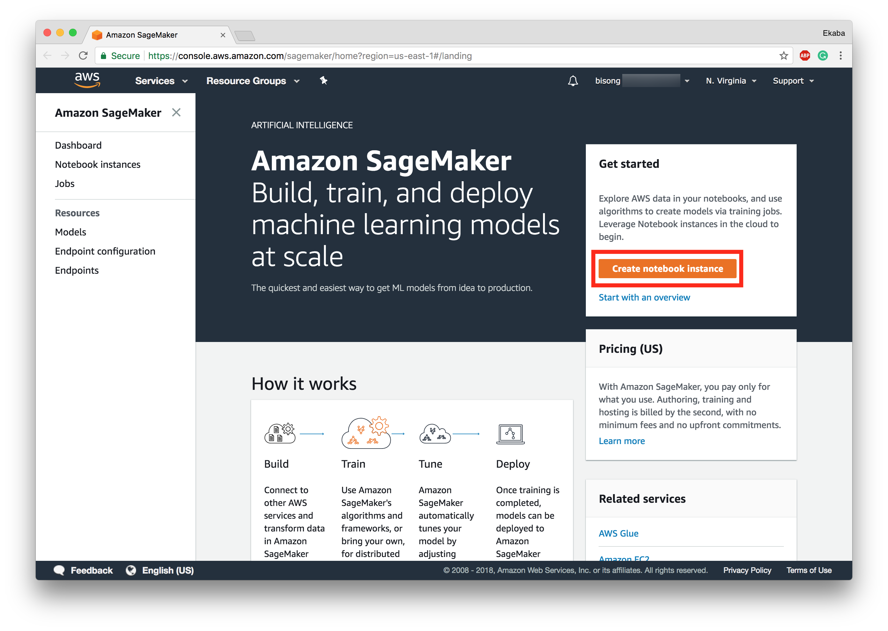
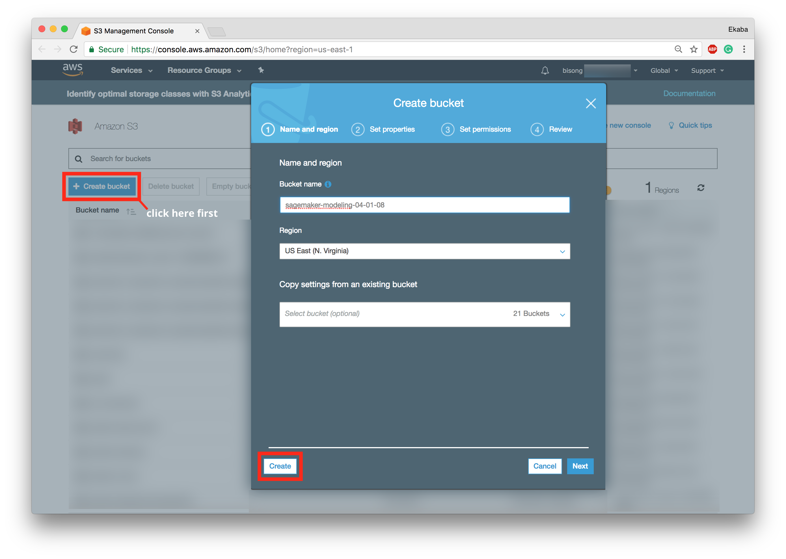
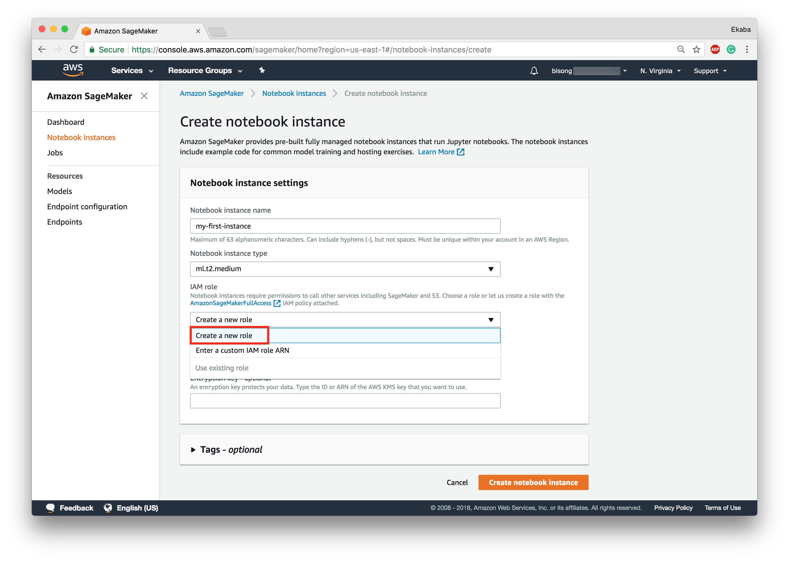
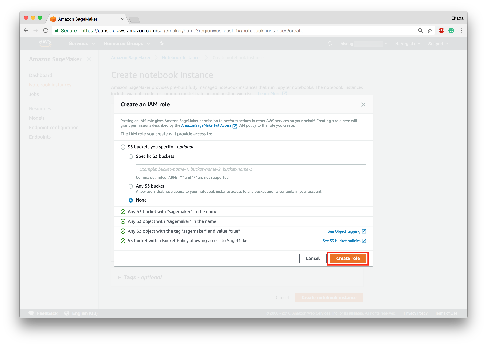
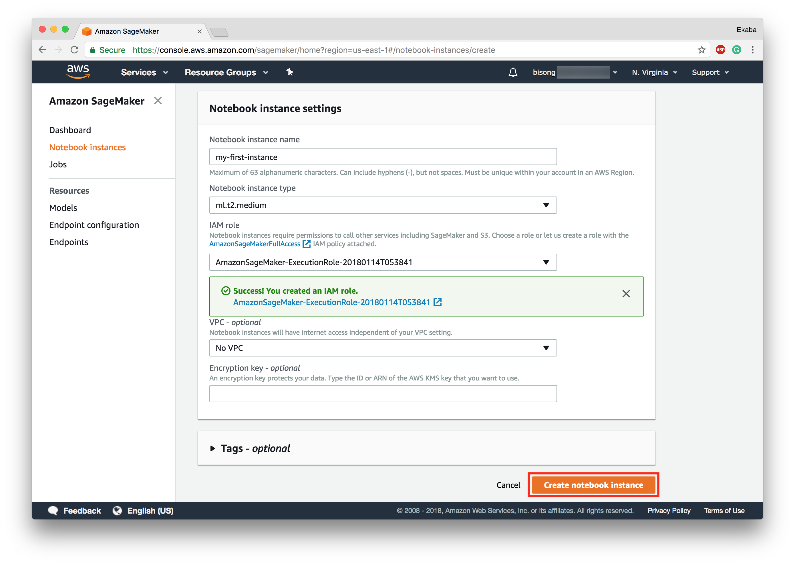
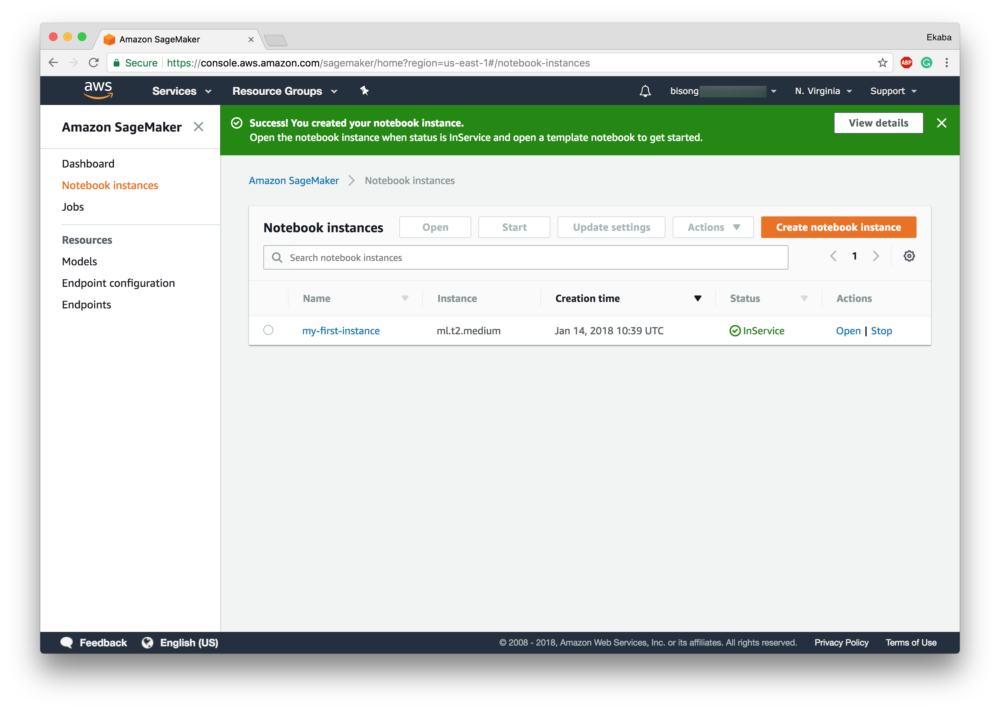
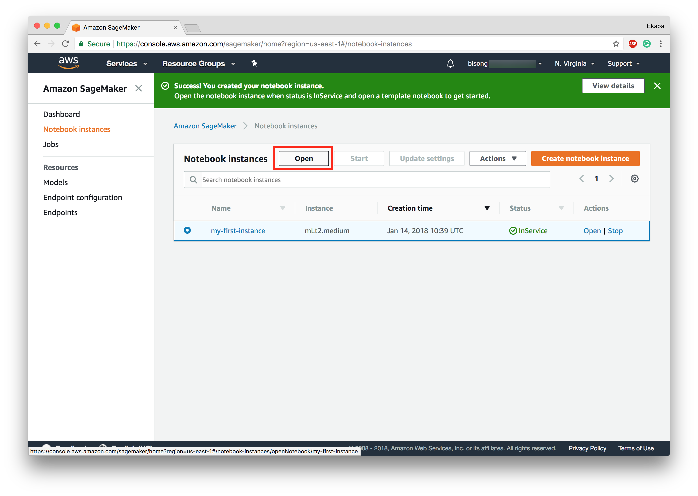
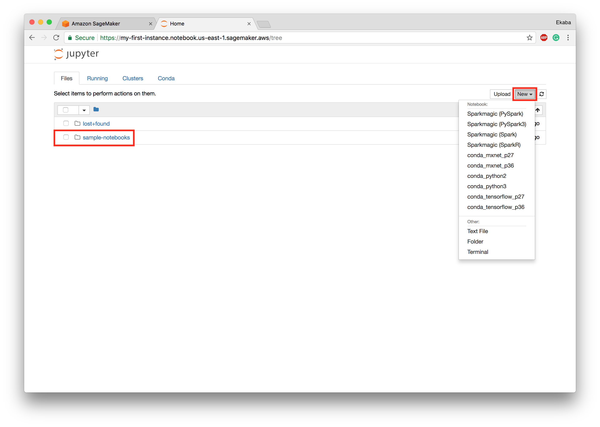
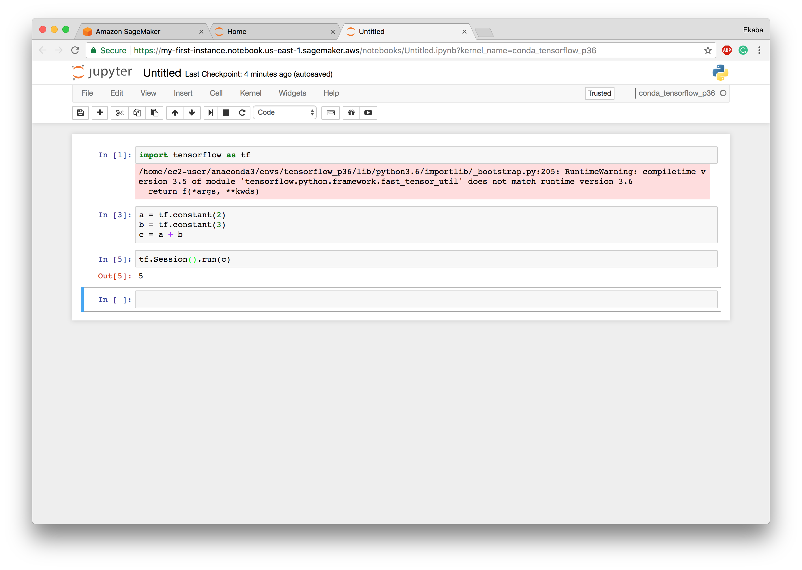

Amazon SageMaker is another cloud-based fully managed data analytics/ machine learning modeling platform for designing, building and deploying data models. The key selling point of Amazon SageMaker is "zero-setup". The concept of "zero-setup" means data science teams can entirely focus on building the model without concern for infrastructure configuration. Also, SageMaker makes available some pre-configured black-boxed modules to streamline the building, training, and deployment of machine learning models. The goal is to further democratize machine learning for software developers without cutting-edge ML expertise.

Amazon SageMaker deploys cloud-based Jupyter notebooks for rapid machine learning design and development. These notebooks are pre-configured to run machine learning libraries like TensorFlow and MXNet. You can link to your data stored on Amazon S3, an Amazon "general purpose" cloud data storage system. As mentioned earlier, SageMaker offers a pre-configured and easy one-click system to build Machine Learning models from your dataset.

In this tutorial, we'll walk you through getting started working with Amazon SageMaker. To begin, please [click here to sign-in to your AWS account](https://console.aws.amazon.com/sagemaker). If you do not have one, you can create a new account before proceeding. The SageMaker dashboard is shown below.

Figure 1: Amazon SageMaker Dashboard

### Create an S3 Bucket
We'll first need a data storage location to store the data for training and evaluating the model. Also, SagerMaker will require a specified bucket to save the contents of the model during the training process. To later give the SageMaker notebook instance access to the S3 bucket, append the word 'sagemaker' to the designated bucket name.

The notebook instance is assigned a default AmazonSageMakerFullAccess IAM role (unless changed in the configuration). [To create an S3 bucket, click here.](https://console.aws.amazon.com/s3/)

Figure 2: Create S3 Bucket

### Create a NoteBook Instance
Amazon SageMaker spins up a cloud-managed Jupyter notebook instance for prototyping, exploring, pre-processing, testing and evaluating your models. To create a notebook instance, click 'create notebook instance' within the red box highlight in *Figure 1*. The notebook instance configuration page is shown in *Figure 3*.

Figure 3: Notebook Instance Configuration

#### Create an IAM Role
Give the notebook instance a name and select an instance type (the default setting is sufficient). To complete the notebook instance configuration, click 'create a new role' to create an IAM role as shown in *Figure 4* below.

Figure 4: Create IAM Role

Click 'create role' to return to the instance configuration page (*Figure 5*).

Figure 5: Create Notebook

Click 'create notebook instance' to spin up the compute engine. The new instance is spurned and shown on the instance page (*Figure 6*). Wait for the status to go from Pending to InService. Then the instance is ready to run a Jupyter notebook.

Figure 6: Notebook Instance Page

#### Open the (Jupyter) Notebook Instance
Select the created instance and click 'Open' to open the instance running Jupyter notebook (*Figure 7*).

Figure 7: Open the Notebook

The Jupyter notebook console is shown in *Figure 8*. From the image below SageMaker comes with sample notebooks to get started with using the out-of-the-box Amazon optimized machine learning models, as well as samples for TensorFlow and MxNet models, and getting started with advanced functionalities like loading an already developed model to SageMaker and setting up an application endpoint.

Figure 8: Notebook Console

Let's create a new notebook and run some TensorFlow code to ensure that all is working as anticipated. Observe that we can open notebooks pre-configured with PySpark, Apache Spark, MxNet, and TensorFlow. We'll open a TensorFlow python3 notebook.

Figure 8: Running TensorFlow

So there you have it, a fully managed, distributed and serverless environment for machine learning modeling and deployment.