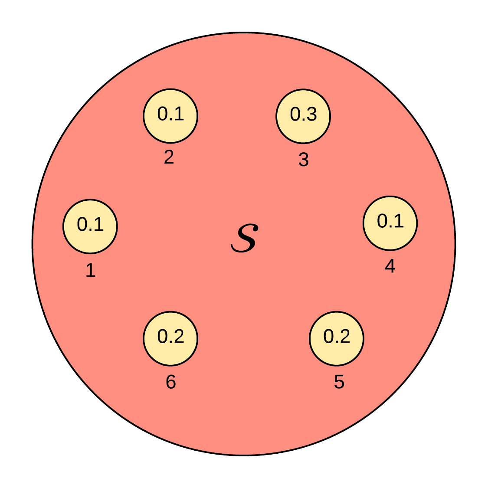
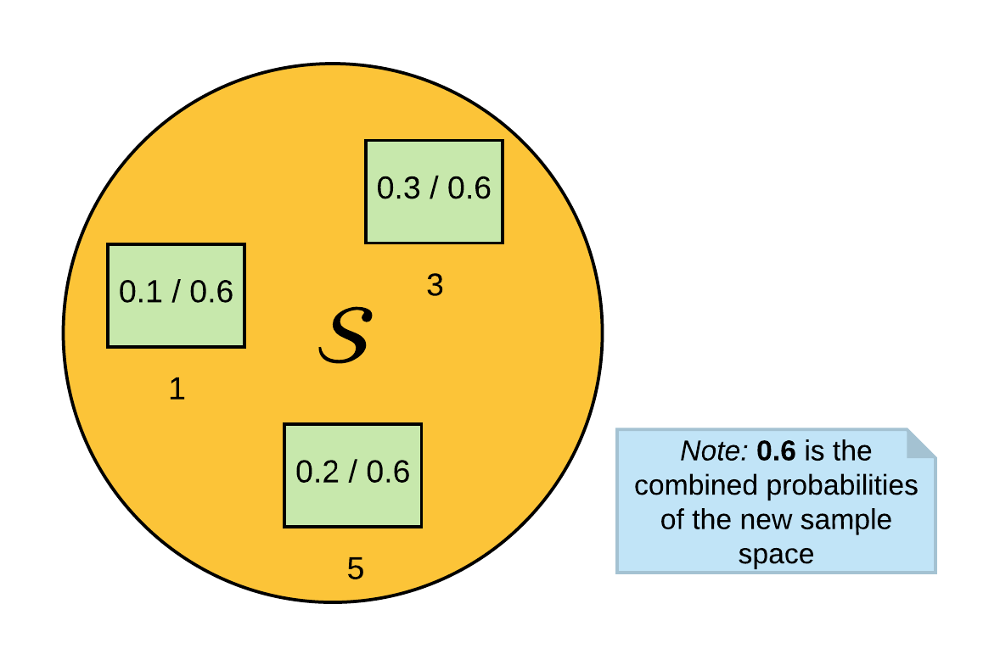
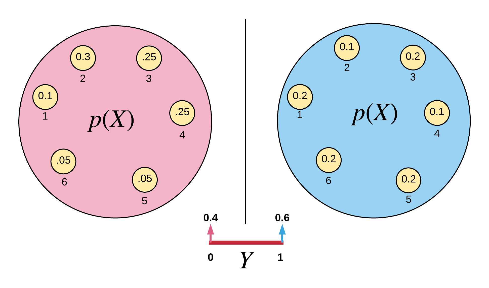

### Axioms
The theory of probability forms the backbone for learning and researching in statistical pattern recognition. Probability theory is one of the most amazing fields of mathematics, and it is based on three simple axioms.

1. The first is that probability of event $$A$$, represented as $$p(A)$$ must be greater than or equal to zero.  
    
    $$p(A) \ge 0$$
    
2. Next, the probability of $$A$$ and $$B$$, is the probability of $$A$$ plus the probability of $$B$$ if $$A$$ and $$B$$ are mutually exclusive. Which means $$A$$ and $$B$$ cannot happen together  
    
    $$P(A\cup B) = P(A) + P(B)\;\; \text{if} \; A \;\text{and}\; B \; \text{are not mutually exclusive}$$
    
3. And finally, the probability of the entire sample is equal to $$1$$.  
    
    $$P(\mathcal{S}) = 1$$

From these three axioms, we see that probability theory is an elegant self-checking mathematics with no event less than $$0$$ and the sum of events must equal $$1$$. Also, observe that the only arithmetic operator involved is the $$+$$ (plus) sign. Howbeit, when we begin to recombine and use these axioms, all other arithmetic operators begin to emerge.

Suppose we have an event space $$\mathcal{S}$$ with the probabilities as shown in *Figure 1* below.

Figure 1: Probability Space: Events

Let us check if the above probability sample space is valid:
1. Are all events greater than zero? Yes.
2. Is the sum of the sample space $$1$$? Yes.
3. If $$A$$ and $$B$$ are mutually exclusive, is their combined probability the sum of their individual probabilities? Yes.

$$
\begin{align*}
\mbox{p(even number)} &= Pr(\mbox{2 or 4 or 6}) \\
&= Pr(2) + Pr(4) + Pr(6) = 0.4
\end{align*}
$$

### Dependence: Information Given
The probability of event $$A$$, $$p(A)$$, given event $$B$$, $$P(B)$$ has already occurred is written as $$P(A \vert B)$$, where the symbol "$$ \vert$$" represents "given". $$p(A|B)$$ is the probability of event $$A$$ and $$B$$, $$p(AB)$$ divided by the probability of event $$B$$, $$p(B)$$. Formally this is defined as:

$$\boxed{p(A \vert B) \triangleq \frac{p(AB)}{p(B)}}$$

This formula is quite intuitive. Suppose we want to find the probability of $$3$$ given that the event is odd, $$p(3 \vert odd)$$. If we select the odd numbers from the probability space (as shown in *Figure 2* below), the probability ceases to be a valid probability space. So, we need to normalize the probabilities by dividing each given event by the sum of their combined probabilities. By normalizing the probability space, we can intuitively select the probability of obtaining a $$3$$ given that the events are odd. This is the dependence property of probabilities.

Figure 2: New Sample Space: Odd Events

Solving for $$p(3 \vert odd)$$, it is now evident from the normalized sample space that the result is $$0.5$$.

Dependent probabilities are formally written as:

$$
\boxed{
\begin{gather*}
p(A \vert B) = \frac{p(AB)}{p(B)} \\
\mbox{we then derive that:} \\
p(AB) = p(A \vert B) \times p(B)
\end{gather*}
}
\label{eqn:dependence}
\tag{1}
$$

### Independence
Two events $$A$$ and $$B$$ are independent events if the probability of $$A$$, $$p(A)$$ is entirely useless or has no information with respect to the probability of $$B$$, $$p(B)$$. Suppose, we are asked the probability of the event $$3$$ occurring given that it snowed in Lagos, i.e., $$p(3 \vert \mbox{"snowed in Lagos"})$$. This expression clearly results in the $$p(3)$$, because it is irrelevant whether it snowed in Lagos or not in finding the probability of $$3$$. This example is the independent property of probabilities. Probability independence is formally expressed as:

$$
\boxed{
\begin{gather*}
p(A \vert B) = p(A) \\
\mbox{but we have that:} \\
p(A \vert B) = \frac{p(AB)}{p(B)} \\
\therefore \frac{p(AB)}{p(B)} = p(A) \\
\mbox{Hence:} \\
p(AB) = p(A) \times p(B)
\end{gather*}
}
\label{eqn:independence}
\tag{2}
$$

### Total Probability
Suppose that the probability of event $$X$$, $$p(X)$$ occurs in two different distributions. We are also given a random variable $$Y$$, and $$Y$$ has only two outcomes $$\{0, 1\}$$. When $$Y = 0$$, draw from the first distribution (left of *Figure 3*), and when $$Y = 1$$, draw from the other distribution (right of *Figure 3*). See *Figure 3* below for the graphical representation.

Figure 3: Total Probability: Sample Distribution

Suppose we are asked:
* What is the probability that $$X = 3$$, given $$Y = 0$$, $$p(X=3 \vert Y = 0)$$. We can obtain our answer as 0.25 by examinining the probability distribution for $$X$$ when $$Y = 0$$.
* What is the probability that $$X = 4$$, given $$Y = 1$$, $$p(X=4 \vert Y = 1)$$. We also obtain our answer as 0.1 by examinining the probability distribution for $$X$$ when $$Y = 1$$.

Now, suppose we are asked the probability that $$X = 3$$, i.e., $$p(X = 3)$$ $$=\;?$$ The answer to this is not obvious from the probability space because we are not told the outcome of $$Y$$. However, we can derive the total probability of $$X = 3$$ if $$Y = 0$$ or $$Y = 1$$. To do this, recall our dependence formula in Equation \ref{eqn:dependence}.

$$
\begin{align*}
p(X=3) &= p(X=3 \vert Y=0) \times p(Y = 0) + p(X=3 \vert Y=1) \times p(Y = 1) \\
&= (0.25)(0.4) + (0.2)(0.6) \\
&= 0.1 + 0.12 \\
&= 0.22
\end{align*}
$$