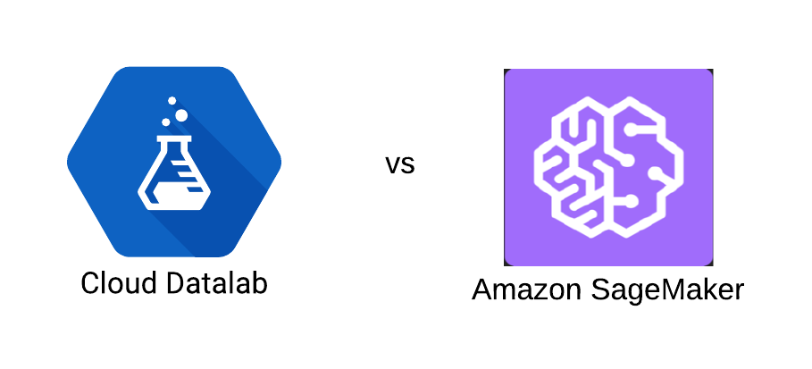
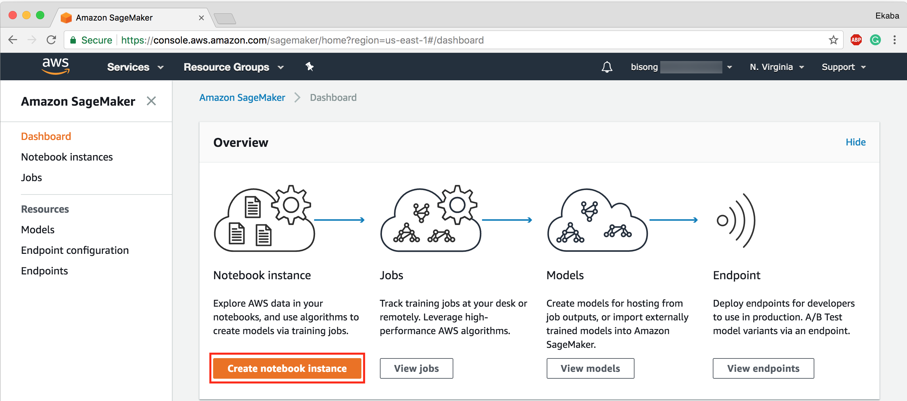
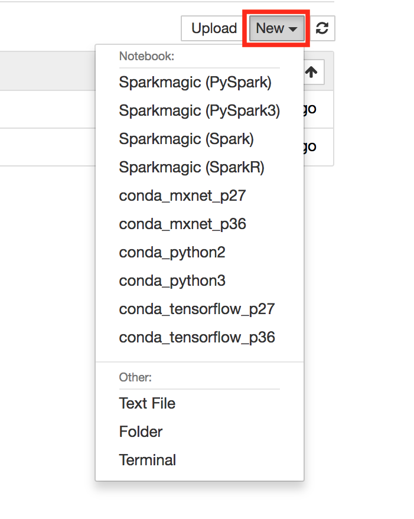
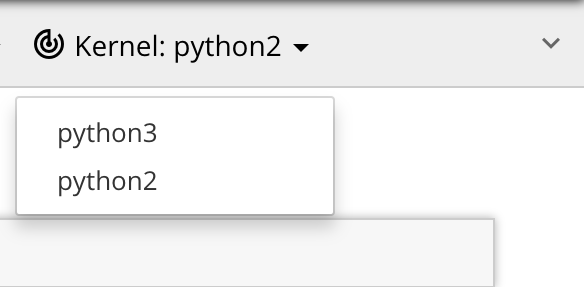

Amazon SageMaker and Google Datalab have fully managed cloud Jupyter notebooks for designing and developing machine learning and deep learning models by leveraging serverless cloud engines. However, they exist key differences between the two offerings as much as they have a lot in common. This post carries out a comparative analysis to examine the subtle differences and similarities between the two cloud-based machine learning as-a-service platforms.

<div class="imgcap">

<div class="thecap"><span style="font-style: italic">Figure 1: </span>Google Datalab vs. Amazon SageMaker</div>
</div>

### Notebook Deployment
Amazon SageMaker and Google Datalab both offer simple notebook server setup procedures. AmazonSageMaker provides a one-click notebook deployment interface once logged into the SageMaker console. 

<div class="imgcap">

<div class="thecap"><span style="font-style: italic">Figure 2: </span>Amazon SageMaker Dashboard</div>
</div>

With Google Datalab, the notebook instance is launched via the Google cloud shell from the Google Cloud Console interface by executing the command `datalab create`. This command can also be executed via the Google Cloud SDK installed on a local machine.

<div class="imgcap">

<div class="thecap"><span style="font-style: italic">Figure 3: </span>Activate cloud shell</div>
</div>

<div class="imgcap">

<div class="thecap"><span style="font-style: italic">Figure 4: </span>Start datalab</div>
</div>

### Pre-loaded Notebook Libraries
Amazon SageMaker Jupyter notebooks come pre-configured to run Apache Spark (including pySpark, SparkR), MxNet, and TensorFlow.

<div class="imgcap">

<div class="thecap"><span style="font-style: italic">Figure 5: </span>Amazon Notebook Pre-loaded packages</div>
</div>

While Google Datalab also has a fully managed Jupyter notebook, it does not come pre-installed with MxNet and Apache Spark. However, TensorFlow (as you will expect) is pre-loaded on all Datalab managed notebooks kernels.

<div class="imgcap">

<div class="thecap"><span style="font-style: italic">Figure 6: </span>Datalab kernels</div>
</div>

In any case, packages like MxNet, can very easily be installed on Datalab notebooks by running console commands via the Datalab `bash` shell. For example, to install MxNetm on Google Cloud Datalab run the following commands.

```bash
%bash
apt-get update
apt-get install -y wget python gcc
wget https://bootstrap.pypa.io/get-pip.py &&$ pip install mxnet==0.11.0 python get-pip.py

pip install mxnet==0.11.0
```

This functionality makes Google Datalab quite flexible because other packages like Keras can be installed to the Datalab compute instance.

This feature is also present in Amazon SageMaker. New packages can be installed into the notebook server under the `conda` environment. For example, one can install Keras into SageMaker notebooks by running the code:

```bash
!conda install -c conda-forge keras --yes
```

The flag `--yes` forces conda to accept all requirements during installation.

### Managed Compute Infrastructure
Amazon SageMaker runs on a fully managed elastic compute server. This abstracts the data scientist/ developer from DevOps concerns. The compute infrastructure auto-scales with respect to the volume of the processed job. Amazon SageMaker fully takes care of health checks, and outline infrastructure maintenance tasks via the built-in "Amazon CloudWatch monitoring and logging" service.

Google Datalab also offers a fully managed compute infrastructure. However, the Datalab server instance is not elastic. If you need more compute capabilities, you have to apply to increase your quota limit. But this is a very simple and straightforward process. Monitoring, logging and server maintenance is managed by the Google Cloud Platform via Google Stackdrier.

### Optimized Machine Learning Algorithms
Amazon SageMaker provides pre-optimized machine learning algorithms. These algorithms are particularly enhanced to run on Amazon's compute servers and are acclaimed to outperform similar algorithms from other packages by an order of magnitude. To use these algorithms, you simply connect them to your data source. The goal of these pre-optimized algorithms is to provide easy access for developers who are not particularly skilled in machine learning to take advantage of AI in their software products. The SageMaker custom algorithms span across a variety of supervised (XGBoost, linear/logistic regression), unsupervised (k-means clustering, principal component analysis (PCA)) and deep learning (DeepAR, Seqence2Sequence) algorithms.

Google Datalab does not have such pre-customized machine learning algorithms. However, machine learning models that are built using TensorFlow are optimized to run on distributed tensor processing units via the Google Cloud ML service. This is also a very powerful feature when working with petabyte scale data.

### Distributed Training
Amazon SageMaker trains your models on a set of distributed compute engines under the hood. These machines are relinquished as soon as training is completed.

Google Datalab trains your models on the Datalab cluster. Although a very powerful multi-core Datalab cluster can be provisioned, it is not distributed across multiple machines. In order to take advantage of distributed training using Cloud ML, the code will have to be packaged as a Python module. As at this time of writing, this feature is limited to TensorFlow code.

### Automated Hyper-parameter Tuning
Amazon SageMaker has an option to perform automated hyper-parameter tuning on your learning model during training. This feature is in preview mode as at this time of writing. But it looks very interesting as it promises to abstract the data scientist or developer from grid search concerns in finding the best set of hyper-parameters for an algorithm training the model.

Google Cloud Datalab (standalone) does not have this sort of functionality. However, Google CloudML has a feature called HyperTune which automatically optimizes your learning model for an improved accuracy or minimized error loss. Training with CloudML is a very powerful feature for training petabyte scale learning models on the Google Cloud Platform. The only downside is that this functionality is limited to models trained with Google TensorFlow.

### Model Deployment
Trained models can be deployed for production directly from Amazon SageMaker to an elastic compute infrastructure with high availability. SageMaker spins up the EC2 instance, deploys the model as well as implements a secure HTTPs endpoint for the application. By integrating this seamless deployment feature to SageMaker, revised/ new machine learning models can quickly be pushed into production without DevOps overhead.

Google Datalab does not directly handle code deployment into production servers. However, the model built on Datalab is packaged into a Python module and deployed on Google CloudML. The models are exposed to your application using Google Cloud Endpoints.

### Pricing
With Amazon SageMaker, billing is based on utilization. By and large, this is same for Google Datalab. However, there are certain perks to their pricing structure that are mostly dependent on customer use-case and demand peculiarities. In general, both Amazon SageMaker and Google Datalab, usually in tandem with other storage and processing infrastructure/ services of their respective cloud hosts (i.e., <a href="https://aws.amazon.com/" target="_blank" rel="noopener">Amazon Web Services</a> and <a href="https://cloud.google.com/" target="_blank" rel="noopener">Google Cloud Platform</a>) offers fair and affordable prices and a convincing reason to consider migrating to the cloud today.

### Conclusion
Amazon SageMaker is primed as a complete and holistic end-to-end machine learning service that integrates building, training and deploying machine learning models into a seamless pipeline. Google Cloud Datalab, on the other hand, is more of a standalone serverless platform for building and training machine learning models. However, Google Cloud Datalab when used together with other ancillary services on the Google Cloud Platform such as Google Cloud ML, it becomes a much more powerful end-to-end machine learning service.