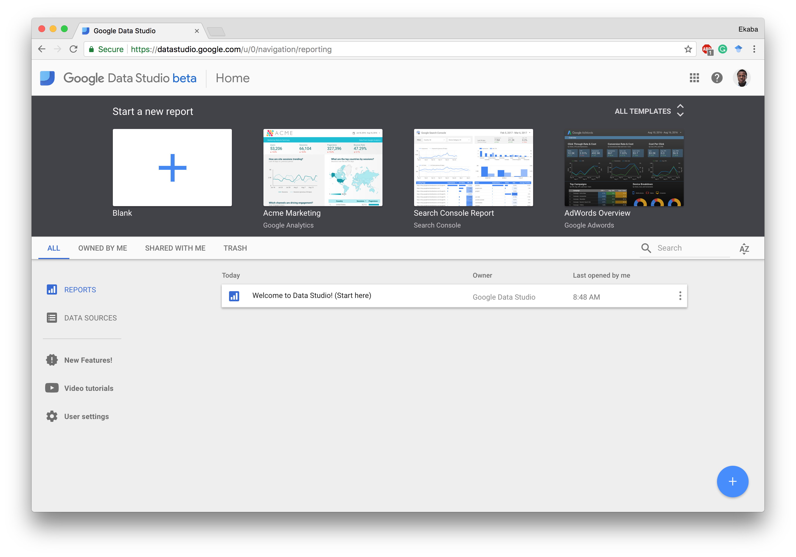

Data Studio is a Google managed solution to rapidly analyze data and create insightful and beautiful reports to facilitate decision making, documentation and research output. Data Studio maintains the sophistication of most traditional Business Intelligence (BI) platforms. It possesses the capabilities to pull and join data from disparate data sources such as Google BigQuery, Google Cloud SQL, MySQL, Google Sheets, and Google Analytics. It is also able to transform the datasets into appropriate metrics for analysis and provide the opportunity for collaborative work in a hosted cloud environment.

Figure 1: Google Data Studio Dashboard

### Using Data Studio
Data Studio is available to use for without cost, provided you have a Google account with a connection to Google Cloud Platform (GCP). The output from Data Studio is stored on Google Drive - so they need to be free space on that as well. Just like shared links from Google Drive, Data Studio reports can be shared and viewed by anyone with the link.

### Connecting to Data
- Click on Data Sources to connect to a data source.
- Click the + symbol in the bottom-right hand to add a data source, you'll have to accept the terms and conitions when using for the first time. CLike the + symbol again to choose a data source.
- Select File Upload - Data Studio uploads Data to Google Cloud Storage. Remember Data Studio is part of the GCP suite of services. Click Authorize to enable Data Studio store custom csv uploads to Google Cloud Storage.
**Do a project with Nigerian Data**

### Creating Visualizations

### Sharing the Data

### Managing Reports and Data Sources
<!--With Amazon SageMaker, billing is based on utilization. By and large, this is same for Google Datalab. However, there are certain perks to their pricing structure that are mostly dependent on customer use-case and demand peculiarities. In general, both Amazon SageMaker and Google Datalab, usually in tandem with other storage and processing infrastructure/ services of their respective cloud hosts (i.e., <a href="https://aws.amazon.com/" target="_blank" rel="noopener">Amazon Web Services</a> and <a href="https://cloud.google.com/" target="_blank" rel="noopener">Google Cloud Platform</a>) offers fair and affordable prices and a convincing reason to consider migrating to the cloud today.-->