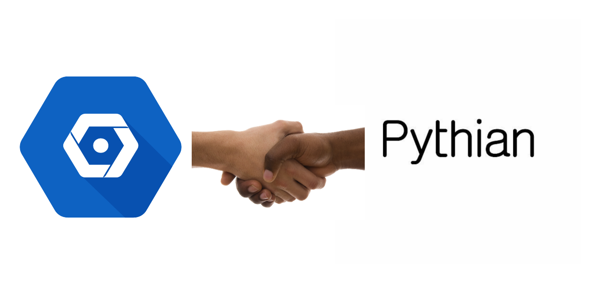

In Day One of the Google Cloud Next 2018 conference which has over 25,000 people in attendance at San Francisco's Moscone center, Google drive, and mission for cloud dominance and on-boarding of enterprise clients couldn't be more poignant. In this conference, up from about 10,000 attendees last year, Google Cloud is sending a strong message to the technology space that it is enterprise-ready and gaining momentum in bringing enterprise companies to the cloud. As an example, Unity, a game engine development company made a migration from AWS to Google Cloud. This move stands out as an example of the tidal shift Google Cloud is making in the cloud product and infrastructure space for Enterprises. Moreso, as a reflection of the giant strides made by the Google Cloud team, they are now listed as a Leader in Gartner's 2018 Magic Quadrant for Cloud Infrastructure as a Service (IaaS), moving up from last year, where they were listed as a Visionary.

Pythian is established as a key partner with Google Cloud Platform on the Cloud vision and mission

Google CEO Diana Greene was quick to point out some of the initiatives and the key principles that drive the Cloud Vision for Google and the reason behind some of the "supercharged-scale" gains that have been observed over the past year. The core initiatives are Google's commitment to open-source and its constant interaction and embrace of the open-source community. Two key examples of Google's partnership and openness with the open-source space is TensorFlow for Machine Learning and Kubernetes for Containerization, which has seen these technologies grow to become most widely adopted within the community together with community best practices. Another initiative is Google's push for Security and Artificial Intelligence within the cloud perimeter. Diana Greene identified Security as the #1 worry for clients and Artificial Intelligence as the #1 opportunity.

Security has been big for Google and is ingrained at every level of Cloud infrastructure/ product implementation. For Google, Security starts with the Titan chips that mitigate firmware threats at the hardware level which is the base level of Computer Organization as the operating system, the file system, and other software application/ utilities depend on the hardware processor.  The Titan chip serves as a "hardware root of trust" to ensure the integrity of the drivers loaded on the machine and mitigates rootkits threats to the data/ information stored on the computing machine. Google's investment in security from the hardware level ensures that it is the cornerstone of the Cloud Platform products and infrastructure.

Google is making big bets and virtually leading from the front in Artificial Intelligence, the great disruptor of the 21st century. As a consequence, AI capabilities are a big part of the Cloud Service and Product offerings. Beginning with Datalab a cloud-based notebook for Machine Learning modeling and experimentation, to the Google Cloud Machine Learning Engine (MLE) for large-scale model training and deployment and the slew of  APIs for AI tasks such as Vision, NLP, translation, and DialogFlow. Announced in this years conference, Google Cloud AutoML has been introduced to further create the capabilities to train high-quality custom machine learning models out of the box. In Beta stage are capabilities for Vision, Natural Language, and Translation. Google Cloud's investment in AI for a key contributor to its dump up Gartner's Quadrant as a Leader in the IaaS space.

### The Pythian Partnership
Google Cloud partnership with Pythian could never be better at this time. As Diana Green put it, "customers really win when the tech companies partner". Pythian is firmly stationed as a key partner in the cloud ecosystem with Google, working hand-in-hand to bring enterprise data work-loads and products to the cloud and to enable companies to optimize their cloud strategy and develop their cloud competencies. Moreso, <a href="https://pythian.com/analytics-as-a-service/" target="_blank" rel="noopener">Pythian's KICKASS (Analytics as a Service)</a> platform provides excellent enterprise tooling for very-large-scale and complex data migrations from on-site database clusters to the Google cloud data warehouse and database offerings.

Pythian's booth at Cloud NEXT 2018 Partner Summit

<!--img src="../assets/pythian_gcp/pythian_booth.jpeg" style="transform:rotate(270deg);"-->

Google Cloud's commitment to Security dovetails nicely with Pythian's own key values and key belief in Security as it drives it's "Love Your Data" mandate. This is the key push behind its development of <a href="https://tehama.io/" target="_blank" rel="noopener">Tehama</a> a super-secure and agile platform for providing IT services globally. Moreso Pythian is well-aligned with Google Cloud strategy for AI with its own Big Data and Enterprise Data Science teams consisting of highly-skilled and experienced experts in AI, Advanced Analytics, Machine Learning and Deep Learning science, programming and engineering to enable clients to win in the market by enhancing their decision support and corporate strategy through harnessing intelligence from data.

**This is a good time to make that push to Google Cloud and the preferred partner to consult, guide and assist on this journey is indisputably no-other but <a href="https://pythian.com/" target="_blank" rel="noopener">Pythian</a>.**