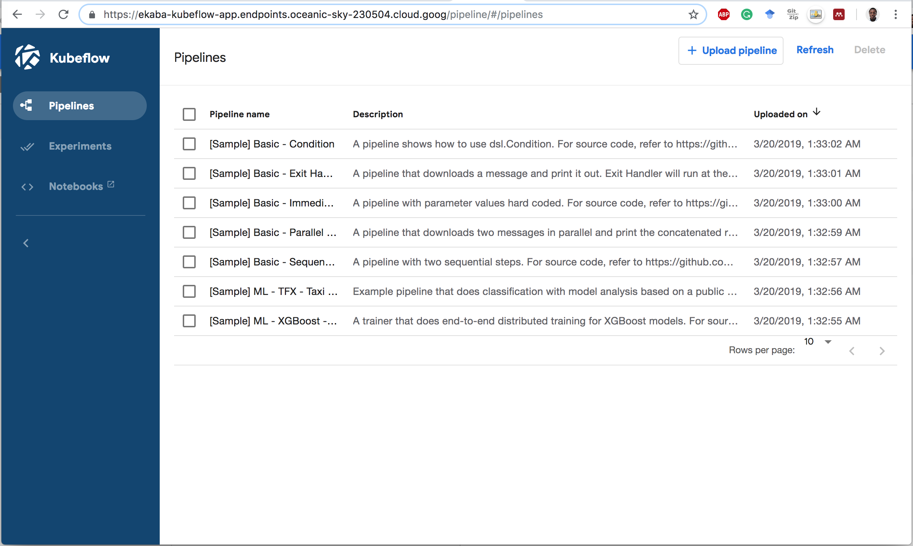
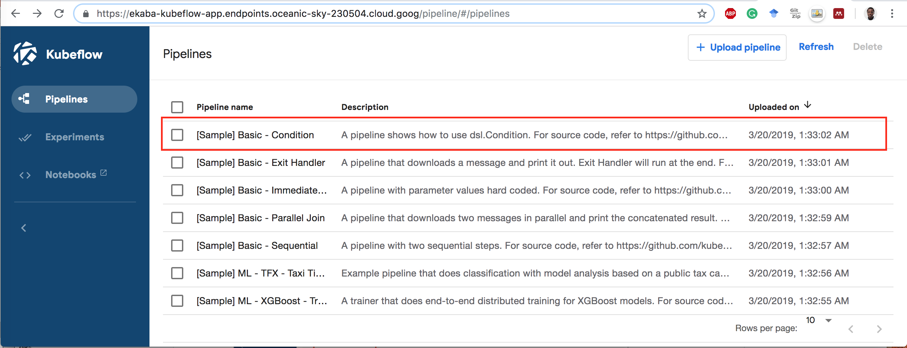
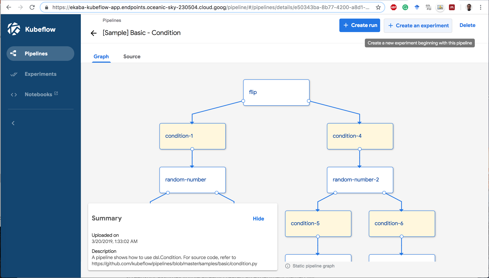
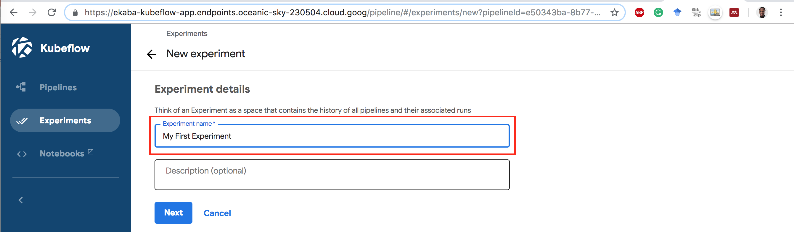
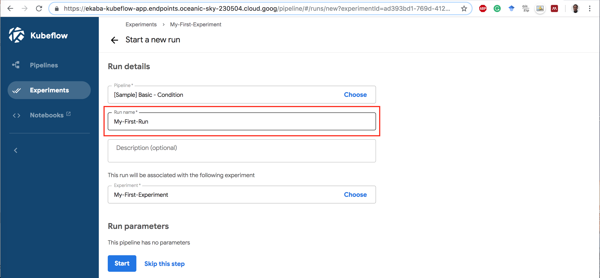
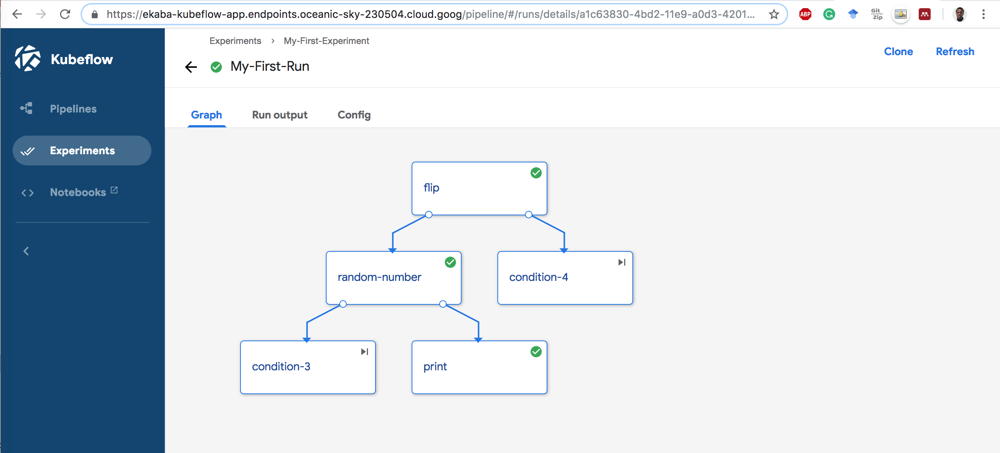

Kubeflow Pipelines is a simple platform for building and deploying containerized machine learning workflows on Kubernetes. Kubeflow pipelines make it easy to implement production grade machine learning pipelines without bothering on the low-level details of managing a Kubernetes cluster.

Kubeflow Pipelines is a core component of Kubeflow and is also deployed when Kubeflow is deployed.

.

## Components of Kubeflow Pipelines
A Pipeline describes a Machine Learning workflow, where each component of the pipeline is a self-contained set of codes that are packaged as Docker images. Each pipeline can be uploaded individually and shared on the Kubeflow Pipelines User Interface (UI). A pipeline takes inputs (parameters) required to run the pipeline and the inputs and outputs of each component.

The Kubeflow Pipelines platform consists of:
- A user interface (UI) for managing and tracking experiments, jobs, and runs.
- An engine for scheduling multi-step ML workflows.
- An SDK for defining and manipulating pipelines and components.
- Notebooks for interacting with the system using the SDK.
(Taken from: <a href="https://www.kubeflow.org/docs/pipelines/pipelines-overview/">Overview of Kubeflow Pipelines</a>)

## Executing a Sample Pipeline

1. Click on the name **[Sample] Basic - Condition**.

.

2. Click **Start an experiment**.

.

3. Give the Experiment a Name.

.

4. Give the Run Name.

.

5. Click on the **Run Name** to start the Run.

.

## Delete Resources
See the end of <a href="/end-to-end-kubeflow-pipelines-kubeflow-for-poets">Deploying an End-to-End Machine Learning Solution on Kubeflow Pipelines</a> to delete billable GCP resources.