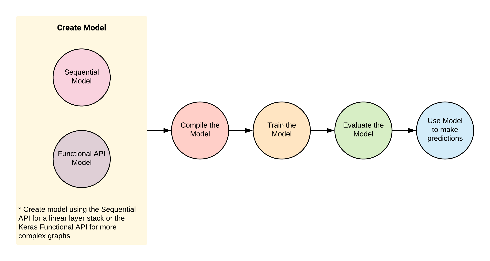
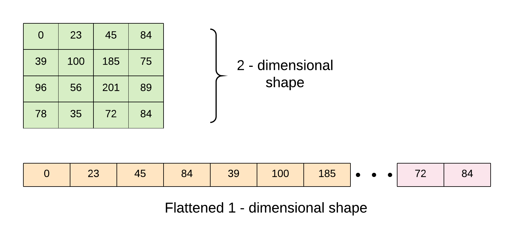
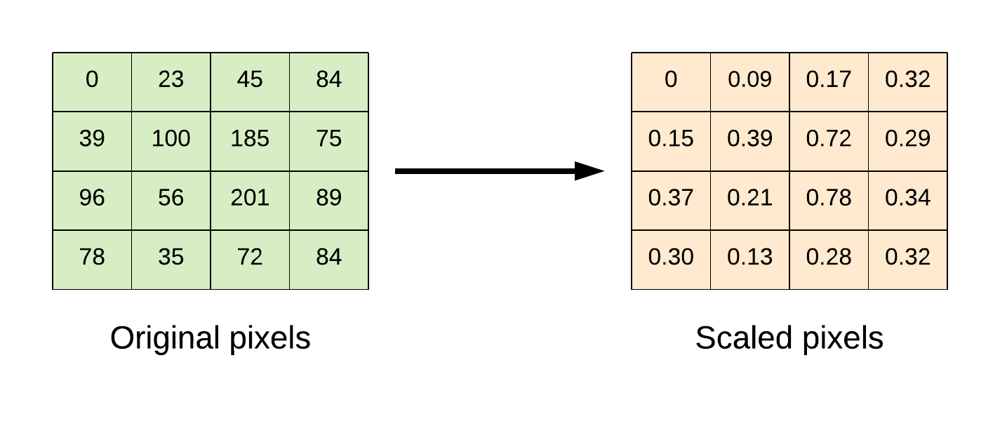

<a name="#notebook-instance"></a>

## Notebook Instance on GCP AI Platform

**Open Notebook Instance**
<div class="imgcap">

<div>.</div>
</div>

**Notebook Instances Dashboard**
<div class="imgcap">

<div>.</div>
</div>

**Start a New Instance**
<div class="imgcap">

<div>.</div>
</div>

<div class="imgcap">

<div>.</div>
</div>

**Open Jupyterlab**
<div class="imgcap">

<div>.</div>
</div>

<div class="imgcap">

<div>.</div>
</div>

<a name="#the-anatomy-of-a-keras-program"></a>

## The Anatomy of a Keras Program
* The **Keras Model** is the core of a Keras programme.
* A Model is:
  * constructed,
  * compiled, then 
  * trained and evaluated using their respective training and evaluation datasets.
  
* Upon satisfactory evaluation, the model is used to make predictions on previously unseen data.

**Program flow for modeling with Keras.**
<div class="imgcap">

<div>.</div>
</div>

### The Keras API
A Keras Model can be constructed using:
* The Sequential API `tf.keras.Sequential` (simple API for creating a linear stack of Neural Networks layers), or
* The Keras Functional API which defines a model instance `tf.keras.Model` for more complex network graphs.

## Multilayer Perceptron (MLP) with Keras
We'll go through the following steps:
- Import and transform the dataset.
- Build and Compile the Model
- Train the data using `Model.fit()`
- Evaluate the Model using `Model.evaluate()`
- Predict on unseen data using `Model.predict()`

### The Dataset
* The dataset used for this example is the Fashion-MNIST database of fashion articles.
* It is similar to the MNIST handwriting dataset.
* It contains 60,000 28x28 pixel grayscale images.
This dataset and more can be found in the `tf.keras.datasets` package.

### Preprocess
**Flatten from 2-dimensional shape to 1-dimension**  
<div class="imgcap">

<div>.</div>
</div>

**Scale pixels from 0 to 255 to be within the range of 0 to 1.**  
<div class="imgcap">

<div>.</div>
</div>

### Code


```python
import tensorflow as tf
import numpy as np

# import dataset
(x_train, y_train), (x_test, y_test) = tf.keras.datasets.fashion_mnist.load_data()

# flatten the 28*28 pixel images into one long 784 pixel vector
x_train = np.reshape(x_train, (-1, 784)).astype('float32')
x_test = np.reshape(x_test, (-1, 784)).astype('float32')

# scale dataset from 0 -> 255 to 0 -> 1
x_train /= 255
x_test /= 255

# one-hot encode targets
y_train = tf.keras.utils.to_categorical(y_train)
y_test = tf.keras.utils.to_categorical(y_test)
 
# create the model
def model_fn():
    model = tf.keras.Sequential()
    # Adds a densely-connected layer with 256 units to the model:
    model.add(tf.keras.layers.Dense(256, activation='relu', input_dim=784))
    # Add Dropout layer
    model.add(tf.keras.layers.Dropout(0.2))
    # Add another densely-connected layer with 64 units:
    model.add(tf.keras.layers.Dense(64, activation='relu'))
    # Add a softmax layer with 10 output units:
    model.add(tf.keras.layers.Dense(10, activation='softmax'))
    
    # compile the model
    model.compile(optimizer=tf.train.AdamOptimizer(0.001),
                  loss='categorical_crossentropy',
                  metrics=['accuracy'])
    return model

# build model
model = model_fn()

# train the model
model.fit(x_train, y_train, epochs=10,
          batch_size=100, verbose=1,
          validation_data=(x_test, y_test))

# evaluate the model
score = model.evaluate(x_test, y_test, batch_size=100)
print('Test loss: {:.2f} \nTest accuracy: {:.2f}%'.format(score[0], score[1]*100))
```

<a name="#using-the-dataset-api-with-tfkeras"></a>

## Using the Dataset API with tf.keras
- The Dataset API is the preferred mechanism for feeding data as it can easily scale to handle very large datasets and better utilize the machine resources.
- The data pipeline is constructed using the Dataset API and the Model is constructed using the **Keras Functional API**.

### Code


```python
import tensorflow as tf
import numpy as np

# import dataset
(x_train, y_train), (x_test, y_test) = tf.keras.datasets.fashion_mnist.load_data()

# flatten the 28*28 pixel images into one long 784 pixel vector
x_train = np.reshape(x_train, (-1, 784)).astype('float32')
x_test = np.reshape(x_test, (-1, 784)).astype('float32')

# scale dataset from 0 -> 255 to 0 -> 1
x_train /= 255
x_test /= 255

# one-hot encode targets
y_train = tf.keras.utils.to_categorical(y_train)
y_test = tf.keras.utils.to_categorical(y_test)

# create dataset pipeline
def input_fn(features, labels, batch_size, training=True):
    dataset = tf.data.Dataset.from_tensor_slices((features, labels))
    if training:
        dataset = dataset.shuffle(buffer_size=1000)
        dataset = dataset.repeat()
    dataset = dataset.batch(batch_size)
    iterator = dataset.make_one_shot_iterator()
    features, labels = iterator.get_next()    
    return features, labels

# parameters
batch_size = 100
training_steps_per_epoch = int(np.ceil(x_train.shape[0] / float(batch_size)))  # ==> 600
eval_steps_per_epoch = int(np.ceil(x_test.shape[0] / float(batch_size)))  # ==> 100
epochs = 10

# create the model
def model_fn(input_fn):
    
    (features, labels) = input_fn
    
    # Model input
    model_input = tf.keras.layers.Input(tensor=features)
    # Adds a densely-connected layer with 256 units to the model:
    x = tf.keras.layers.Dense(256, activation='relu', input_dim=784)(model_input)
    # Add Dropout layer:
    x = tf.keras.layers.Dropout(0.2)(x)
    # Add another densely-connected layer with 64 units:
    x = tf.keras.layers.Dense(64, activation='relu')(x)
    # Add a softmax layer with 10 output units:
    predictions = tf.keras.layers.Dense(10, activation='softmax')(x)
    
    # the model
    model = tf.keras.Model(inputs=model_input, outputs=predictions)
    
    # compile the model
    model.compile(optimizer='adam',
                  loss='categorical_crossentropy',
                  metrics=['accuracy'],
                  target_tensors=[tf.cast(labels,tf.float32)])
    return model

# build train model
model = model_fn(input_fn(x_train, y_train, batch_size=batch_size, training=True))

# print train model summary
model.summary()
```


```python
# train the model
history = model.fit(epochs=epochs,
                    steps_per_epoch=training_steps_per_epoch)
```


```python
# store trained model weights
model.save_weights('/tmp/mlp_weight.h5')

# build evaluation model
eval_model = model_fn(input_fn(x_test, y_test, batch_size=batch_size, training=False))
# load saved weights to evaluation model
eval_model.load_weights('/tmp/mlp_weight.h5')

# evaluate the model
score = eval_model.evaluate(steps=eval_steps_per_epoch)
print('Test loss: {:.2f} \nTest accuracy: {:.2f}%'.format(score[0], score[1]*100))
```

<a name="#tensorboard-with-keras"></a>

## TensorBoard with Keras
To visualize models with TensorBoard, attach a TensorBoard callback `tf.keras.callbacks.TensorBoard()` to the `model.fit()` method before training the model. The model graph, scalars, histograms, and other metrics are stored as event files in the log directory.

For this example, we'll build an MLP MNIST model and visualize it with TensorBoard.

### Code


```python
import tensorflow as tf
import numpy as np

# import dataset
(x_train, y_train), (x_test, y_test) = tf.keras.datasets.mnist.load_data()

# flatten the 28*28 pixel images into one long 784 pixel vector
x_train = np.reshape(x_train, (-1, 784)).astype('float32')
x_test = np.reshape(x_test, (-1, 784)).astype('float32')

# scale dataset from 0 -> 255 to 0 -> 1
x_train /= 255
x_test /= 255

# one-hot encode targets
y_train = tf.keras.utils.to_categorical(y_train)
y_test = tf.keras.utils.to_categorical(y_test)
 
# create the model
def model_fn():
    inputs = tf.keras.Input(shape=(784,))
    x = tf.keras.layers.Dense(128, activation='relu', input_dim=784)(inputs)
    x = tf.keras.layers.Dropout(0.2)(x)
    x = tf.keras.layers.Dense(64, activation='relu')(x)
    prediction = tf.keras.layers.Dense(10, activation='softmax')(x)
    
    model = tf.keras.Model(inputs=inputs, outputs=prediction)
    
    # compile the model
    model.compile(optimizer='adam',
                  loss='categorical_crossentropy',
                  metrics=['accuracy'])
    return model

# build model
model = model_fn()

# checkpointing
best_model = tf.keras.callbacks.ModelCheckpoint('./tmp/mnist_weights.h5', monitor='val_acc',
                                                verbose=1, save_best_only=True, mode='max')

# tensorboard
tensorboard = tf.keras.callbacks.TensorBoard(log_dir='./tmp/logs_mnist_keras',
                                             histogram_freq=0, write_graph=True,
                                             write_images=True)

callbacks = [best_model, tensorboard]

# train the model
history = model.fit(x_train, y_train, epochs=10,
                    batch_size=100, verbose=1,
                    validation_data=(x_test, y_test),
                    callbacks=callbacks)

# evaluate the model
score = model.evaluate(x_test, y_test, batch_size=100)
print('Test loss: {:.2f} \nTest accuracy: {:.2f}%'.format(score[0], score[1]*100))
```


```python
# execute the command to run TensorBoard.
```


```python
!tensorboard --logdir tmp/logs_mnist_keras
```

<a name="#checkpointing-to-select-best-models"></a>

## Checkpointing to Select Best Models
- Checkpointing makes it possible to save the weights of the neural network model when there is an increase in the validation accuracy metric.
- This is achieved in Keras using the method `tf.keras.callbacks.ModelCheckpoint()`.
- The saved weights can then be loaded back into the model and used to make predictions.

Using the MNIST dataset, we'll build a model that saves the weights to file only when there is an improvement in the validation set performance.

### Code


```python
import tensorflow as tf
import numpy as np

# import dataset
(x_train, y_train), (x_test, y_test) = tf.keras.datasets.mnist.load_data()

# flatten the 28*28 pixel images into one long 784 pixel vector
x_train = np.reshape(x_train, (-1, 784)).astype('float32')
x_test = np.reshape(x_test, (-1, 784)).astype('float32')

# scale dataset from 0 -> 255 to 0 -> 1
x_train /= 255
x_test /= 255

# one-hot encode targets
y_train = tf.keras.utils.to_categorical(y_train)
y_test = tf.keras.utils.to_categorical(y_test)
 
# create the model
def model_fn():
    inputs = tf.keras.Input(shape=(784,))
    x = tf.keras.layers.Dense(128, activation='relu', input_dim=784)(inputs)
    x = tf.keras.layers.Dropout(0.2)(x)
    x = tf.keras.layers.Dense(64, activation='relu')(x)
    prediction = tf.keras.layers.Dense(10, activation='softmax')(x)
    
    model = tf.keras.Model(inputs=inputs, outputs=prediction)
    
    # compile the model
    model.compile(optimizer='adam',
                  loss='categorical_crossentropy',
                  metrics=['accuracy'])
    return model

# build model
model = model_fn()

# checkpointing
checkpoint = tf.keras.callbacks.ModelCheckpoint('mnist_weights.h5', monitor='val_acc',
                                                verbose=1, save_best_only=True, mode='max')
callbacks = [checkpoint]

# train the model
history = model.fit(x_train, y_train, epochs=10,
                    batch_size=100, verbose=1,
                    validation_data=(x_test, y_test),
                    callbacks=callbacks)

# evaluate the model
score = model.evaluate(x_test, y_test, batch_size=100)
print('Test loss: {:.2f} \nTest accuracy: {:.2f}%'.format(score[0], score[1]*100))
```

<a name="#convolutional-neural-networks-cnns-with-keras"></a>

## Convolutional Neural Networks (CNNs) with Keras
In this section, we use Keras to implement a Convolutional Neural Network. The network architecture is similar to the [Krizhevsky architecture](https://papers.nips.cc/paper/4824-imagenet-classification-with-deep-convolutional-neural-networks.pdf) and consists of the following layers:
- Convolution layer: kernel_size => [5 x 5]
- Convolution layer: kernel_size => [5 x 5]
- Batch Normalization layer
- Convolution layer: kernel_size => [5 x 5]
- Max pooling: pool size => [2 x 2]
- Convolution layer: kernel_size => [5 x 5]
- Convolution layer: kernel_size => [5 x 5]
- Batch Normalization layer
- Max pooling: pool size => [2 x 2]
- Convolution layer: kernel_size => [5 x 5]
- Convolution layer: kernel_size => [5 x 5]
- Convolution layer: kernel_size => [5 x 5]
- Max pooling: pool size => [2 x 2]
- Dropout layer
- Dense Layer: units => [512]
- Dense Layer: units => [256]
- Dropout layer
- Dense Layer: units => [10]

### Dataset
* The dataset used for this example is the Cifar10 image dataset.
* It consists of 60000 32x32 colour images in 10 classes, with 6000 images per class.
* There are 50000 training images and 10000 test images.
* The 10 classes are: [airplane, automobile, bird, cat, deer, dog, frog, horse, ship, truck]

This dataset and more can be found in the `tf.keras.datasets` package.

### Code


```python
# import dataset
(x_train, y_train), (x_test, y_test) = tf.keras.datasets.cifar10.load_data()

# change datatype to float
x_train = x_train.astype('float32')
x_test = x_test.astype('float32')

# scale the dataset from 0 -> 255 to 0 -> 1
x_train /= 255
x_test /= 255

# one-hot encode targets
y_train = tf.keras.utils.to_categorical(y_train)
y_test = tf.keras.utils.to_categorical(y_test)

# create dataset pipeline
def input_fn(features, labels, batch_size, training=True):
    dataset = tf.data.Dataset.from_tensor_slices((features, labels))
    if training:
        dataset = dataset.shuffle(buffer_size=1000)
        dataset = dataset.repeat()
    dataset = dataset.batch(batch_size)
    iterator = dataset.make_one_shot_iterator()
    features, labels = iterator.get_next()    
    return features, labels

# parameters
batch_size = 100
training_steps_per_epoch = int(np.ceil(x_train.shape[0] / float(batch_size)))  # ==> 600
eval_steps_per_epoch = int(np.ceil(x_test.shape[0] / float(batch_size)))  # ==> 100
epochs = 10

# create the model
def model_fn(input_fn):
    
    (features, labels) = input_fn
    
    # Model input
    model_input = tf.keras.layers.Input(tensor=features)
    x = tf.keras.layers.Conv2D(64, (5, 5), padding='same', activation='relu')(model_input)
    x = tf.keras.layers.Conv2D(64, (5, 5), padding='same', activation='relu')(x)
    x = tf.keras.layers.BatchNormalization()(x)
    x = tf.keras.layers.Conv2D(64, (5, 5), padding='same', activation='relu')(x)
    x = tf.keras.layers.MaxPooling2D(pool_size=(2, 2), strides=2, padding='same')(x)
    x = tf.keras.layers.Conv2D(64, (5, 5), padding='same', activation='relu')(x)
    x = tf.keras.layers.Conv2D(64, (5, 5), padding='same', activation='relu')(x)
    x = tf.keras.layers.BatchNormalization()(x)
    x = tf.keras.layers.MaxPooling2D(pool_size=(2, 2), strides=2, padding='same')(x)
    x = tf.keras.layers.Conv2D(32, (3, 3), padding='same', activation='relu')(x)
    x = tf.keras.layers.Conv2D(32, (3, 3), padding='same', activation='relu')(x)
    x = tf.keras.layers.Conv2D(32, (3, 3), padding='same', activation='relu')(x)
    x = tf.keras.layers.MaxPooling2D(pool_size=(2, 2), strides=2, padding='same')(x)
    x = tf.keras.layers.Dropout(0.3)(x)
    x = tf.keras.layers.Flatten()(x)
    x = tf.keras.layers.Dense(512, activation='relu')(x)
    x = tf.keras.layers.Dense(256, activation='relu')(x)
    x = tf.keras.layers.Dropout(0.5)(x)
    output = tf.keras.layers.Dense(10, activation='softmax')(x)
    
    # the model
    model = tf.keras.Model(inputs=model_input, outputs=output)
    
    # compile the model
    model.compile(optimizer=tf.keras.optimizers.Nadam(),
                  loss='categorical_crossentropy',
                  metrics=['accuracy'],
                  target_tensors=[tf.cast(labels,tf.float32)])
    return model

# build train model
model = model_fn(input_fn(x_train, y_train, batch_size=batch_size, training=True))

# print train model summary
model.summary()
```


```python
# train the model
history = model.fit(epochs=epochs,
                    steps_per_epoch=training_steps_per_epoch)
```


```python
# store trained model weights
model.save_weights('./tmp/cnn_weight.h5')

# build evaluation model
eval_model = model_fn(input_fn(x_test, y_test, batch_size=batch_size, training=False))
eval_model.load_weights('./tmp/cnn_weight.h5')

# evaluate the model
score = eval_model.evaluate(steps=eval_steps_per_epoch)
print('Test loss: {:.2f} \nTest accuracy: {:.2f}%'.format(score[0], score[1]*100))
```

<a name="#recurrent-neural-networks-rnns-with-keras"></a>

## Recurrent Neural Networks (RNNs) with Keras
This section uses the Nigeria power consumption univariate timeseries dataset to implement a LSTM Recurrent Neural Network.


```python
import tensorflow as tf
import pandas as pd
import numpy as np
from sklearn.model_selection import train_test_split
from sklearn.preprocessing import MinMaxScaler

# data url
url = "https://raw.githubusercontent.com/dvdbisong/gcp-learningmodels-book/master/Chapter_12/nigeria-power-consumption.csv"

# load data
parse_date = lambda dates: pd.datetime.strptime(dates, '%d-%m')
data = pd.read_csv(url, parse_dates=['Month'], index_col='Month',
                   date_parser=parse_date,
                   engine='python', skipfooter=2)

# print column name
data.columns

# change column names
data.rename(columns={'Nigeria power consumption': 'power-consumption'},
            inplace=True)

# split in training and evaluation set
data_train, data_eval = train_test_split(data, test_size=0.2, shuffle=False)

# MinMaxScaler - center ans scale the dataset
scaler = MinMaxScaler(feature_range=(0, 1))
data_train = scaler.fit_transform(data_train)
data_eval = scaler.fit_transform(data_eval)

# adjust univariate data for timeseries prediction
def convert_to_sequences(data, sequence, is_target=False):
    temp_df = []
    for i in range(len(data) - sequence):
        if is_target:
            temp_df.append(data[(i+1): (i+1) + sequence])
        else:
            temp_df.append(data[i: i + sequence])
    return np.array(temp_df)

# parameters
time_steps = 20
inputs = 1
neurons = 100
outputs = 1
batch_size = 32

# create training and testing data
train_x = convert_to_sequences(data_train, time_steps, is_target=False)
train_y = convert_to_sequences(data_train, time_steps, is_target=True)

eval_x = convert_to_sequences(data_eval, time_steps, is_target=False)
eval_y = convert_to_sequences(data_eval, time_steps, is_target=True)

# Build model
model = tf.keras.Sequential()
model.add(tf.keras.layers.LSTM(128, dropout=0.2, recurrent_dropout=0.2,
                               input_shape=train_x.shape[1:],
                               return_sequences=True))
model.add(tf.keras.layers.Dense(1))

# Compile the model
model.compile(loss='mean_squared_error',
              optimizer='adam',
              metrics=['mse'])

# print model summary
model.summary()
```


```python
# Train the model
history = model.fit(train_x, train_y,
                    batch_size=batch_size,
                    epochs=20, shuffle=False,
                    validation_data=(eval_x, eval_y))
```


```python
loss, mse = model.evaluate(eval_x, eval_y, batch_size=batch_size)
print('Test loss: {:.4f}'.format(loss))
print('Test mse: {:.4f}'.format(mse))

# predict
y_pred = model.predict(eval_x)

# plot predicted sequence
plt.title("Model Testing", fontsize=12)
plt.plot(eval_x[0,:,0], "b--", markersize=10, label="training instance")
plt.plot(eval_y[0,:,0], "g--", markersize=10, label="targets")
plt.plot(y_pred[0,:,0], "r--", markersize=10, label="model prediction")
plt.legend(loc="upper left")
plt.xlabel("Time")
```
